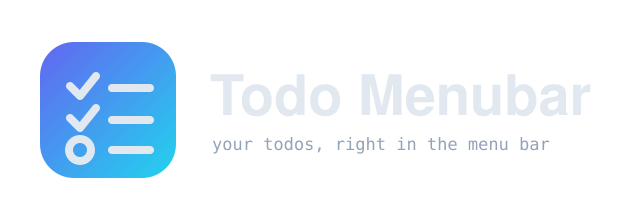
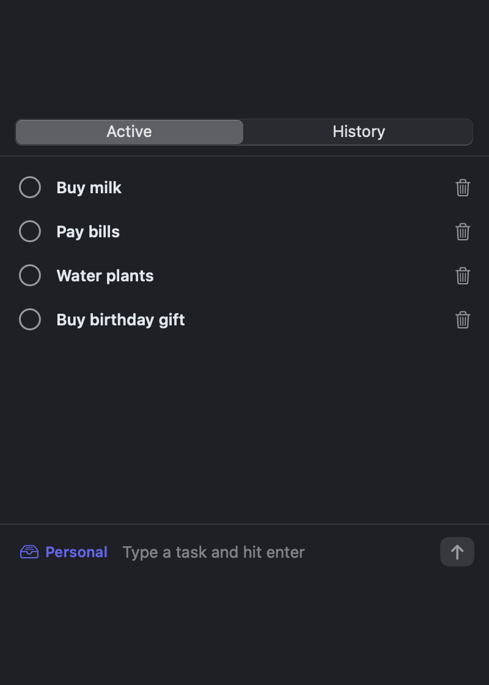
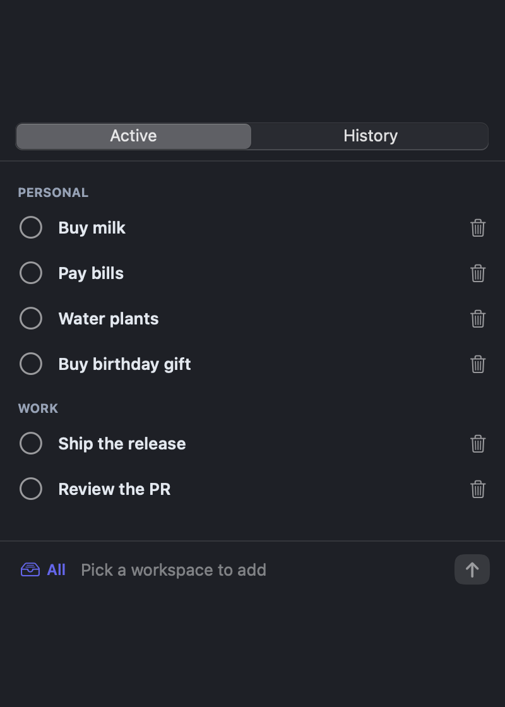
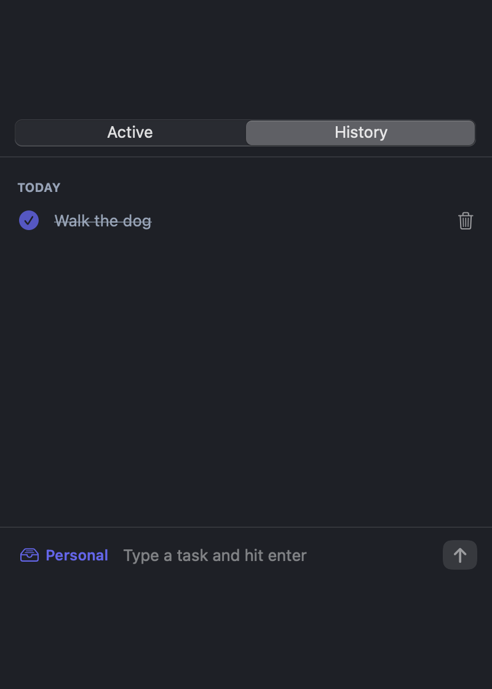

<p align="center">
  
</p>

<p align="center">
  <a href="https://djalmaaraujo.github.io/todo-menubar/">djalmaaraujo.github.io/todo-menubar</a>
</p>

<p align="center">
  <strong>Your todos, right in the menu bar.</strong><br>
  A tiny native macOS menu bar todo list, organized by workspace. No cloud, no account, no sync — everything stays on your machine.
</p>

<p align="center">
  
  
  
  
</p>

<p align="center">
  
</p>

---

## What it does

Click the menu bar icon, jot a task, hit enter. That's the whole app.

- **Workspaces** — separate your contexts (Personal, Work, whatever). Switch from the selector next to the input; the list changes with it.
- **All view** — one selection lists every workspace, grouped under its own header.
- **Active / History tabs** — checking a task off moves it out of Active and into a date-grouped **History** timeline. Delete from either.
- **Add, complete, delete** — a circle to complete, a trash can to remove. Nothing else to learn.
- **Menu bar count** — the icon shows how many active tasks the current selection has.

Create a workspace with the **+ New workspace…** item in the selector; rename or delete it from the same menu (deleting takes its tasks and history with it).

<p align="center">
  
  &nbsp;
  
</p>

## Dependencies

- **Runtime:** none. It's a single self-contained `.app`.
- **Bundled with macOS:** SwiftUI + AppKit.
- **Build only:** Xcode Command Line Tools (`swiftc`). No package manager, no Xcode project.

Requires macOS 13 or later, Apple silicon.

## Install

**Homebrew**

```sh
brew install djalmaaraujo/tap/todo-menubar
```

**From source**

```sh
git clone https://github.com/djalmaaraujo/todo-menubar.git
cd todo-menubar/app
./build.sh
```

`build.sh` compiles the app with `swiftc`, ad-hoc signs it, and opens it.

## How it works

```
UserDefaults (JSON blob)
        │
        ▼
   TodoState  ──►  TodoStore (ObservableObject)
   pure logic       persists on every mutation
        │
        ▼
   MenuBarExtra(.window)  ──►  the popover you see
```

`TodoCore.swift` holds the whole model and every operation as pure, testable
functions. `App.swift` is just SwiftUI on top. Run the logic tests with
`cd app && ./test.sh`.

## Privacy

Everything lives in `UserDefaults` on your Mac. No network calls, no account, no
telemetry, no sync. If you delete the app, your tasks go with it.

## Why

I wanted the smallest possible todo list that lives where I already look a hundred
times a day — the menu bar — without opening yet another app or signing into
anything. It follows the same build and design as
[`pr-menubar`](https://github.com/djalmaaraujo/pr-menubar) and
[`claude-usage-menubar`](https://github.com/djalmaaraujo/claude-usage-menubar).

## License

MIT © Djalma Araújo
